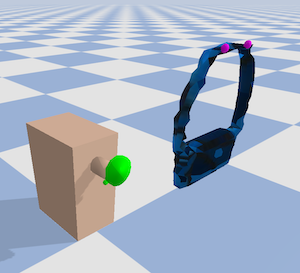
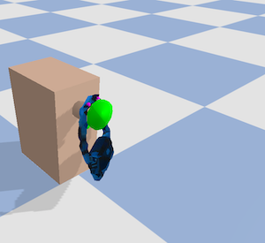
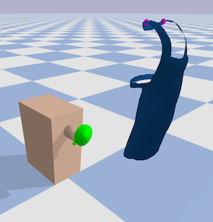
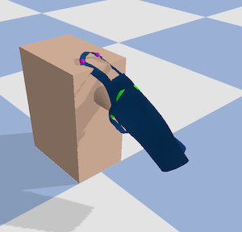

# Dynamic Environments with Deformable Objects

TODO: port the rest of the code and add documentation

Workshop page with paper+poster: https://sites.google.com/nvidia.com/do-sim/posters


**Table of Contents:**<br />
[Installation](#install)<br />
[Examples](#examples)<br />

<a name="install"></a>
## Installation

Optional initial step: create a new conda environment with
`conda create --name dedo python=3.8` and activate it with
`conda activate dedo`. Conda is not strictly needed;
alternatives like virtualenv can be used;
a direct install without using virtual environments is ok as well.

```
git clone https://github.com/contactrika/dedo
cd dedo
pip install numpy
pip install -e .
```


### Examples

```
python -m dedo.demo --task=HangBag --viz --debug
```




```
python -m dedo.demo --task=HangCloth --viz --debug
```



