### DEDO  - Dynamic Environments with Deformable Objects
DEDO is a lightweight and customizable suite of environments with
deformable objects. It is aimed for researchers in the machine learning, 
reinforcement learning, robotics and computer vision communities.
The suite provides a set of every day tasks that involve deformables, 
such as hanging cloth, dressing a person, and buttoning buttons. 
We provide examples for integrating two popular 
reinforcement learning libraries: [StableBaselines3](https://github.com/DLR-RM/stable-baselines3) 
and [RLlib](https://docs.ray.io/en/latest/rllib.html).
We also provide reference implementaionts for training a various 
Variational Autoencoder variants with our environment. 
DEDO is easy to set up and has few dependencies, it is
highly parallelizable and supports a wide range of customizations: 
loading custom objects and textures, adjusting material properties. 

For a brief overview, please see our intro [video](https://www.youtube.com/watch?v=5eA8z80c9Zc). For more details please see the [paper](https://openreview.net/forum?id=WcY35wjmCBA).

```
@inproceedings{dedo2021,
  title={Dynamic Environments with Deformable Objects},
  author={Rika Antonova and Peiyang Shi and Hang Yin and Zehang Weng and Danica Kragic},
  booktitle={Conference on Neural Information Processing Systems (NeurIPS) Datasets and Benchmarks Track},
  year={2021},
}
```

**Table of Contents:**<br />
[Installation](#install)<br />
[GettingStarted](#examples)<br />
[Tasks](#tasks)<br />
[Use with RL](#rl)<br />
[Use with VAE](#svae)<br />
[Customization](#custom)<br />

Please refer to **[Wiki for the full documentation ](../../wiki)**

<a name="install"></a>
## Installation

_Optional initial step_:  create a new conda environment with
`conda create --name dedo python=3.7` and activate it with
`conda activate dedo`. 
Conda is not strictly needed, alternatives like virtualenv can be used;
a direct install without using virtual environments is ok as well.


```
git clone https://github.com/contactrika/dedo
cd dedo
pip install numpy  # important: for numpy-enabled PyBullet
pip install -e .
```
Python3.7 is recommended, since PyBullet compilation can have difficulties with Python 3.8 in some cases.

To enable recording/logging videos install ffmpeg:
```
sudo apt-get install ffmpeg
```
See more in **[Installation Guide in wiki](../../wiki/Installation)**
<a name="examples"></a>
## Getting started
To get started, one can run one of the following commands to visualize the tasks through a hard-coded policy. 

```
python -m dedo.demo --env=HangGarment-v1 --viz --debug
```

* `dedo.demo` is the demo module
* `--env=HangGarment-v1` specifies the environment
* `--viz` enables the GUI
* `---debug` outputs additional information in the console
* `--cam_resolution 400` specifies the size of the output window


See more in **[Usage-guide](../../wiki/Usage-guide)**


## Tasks
See more in **[Task Overview](../../wiki/Tasks-Overview)**

We provide a set of 10 tasks involving deformable objects, most tasks contains 5 handmade deformable objects. 
There are also two procedurally generated tasks, `ButtonProc` and `HangProcCloth`, in which the deformable objects are procedurally generated. 
Furthermore, to improve generalzation, the `v0` of each task will randomizes textures and meshes.

All tasks have `-v1` and `-v2` with a particular choice of meshes and textures
that is not randomized. Most tasks have versions up to `-v5` with additional
mesh and texture variations.

Tasks with procedurally generated cloth (`ButtonProc` and `HangProcCloth`)
generate random cloth objects for all versions (but randomize textures only
in `v0`).

### HangBag

```
python -m dedo.demo_preset --env=HangBag-v1 --viz
```
`HangBag-v0`: selects one of 108 bag meshes; randomized textures

`HangBag-v[1-3]`: three bag versions with textures shown below:


### HangGarment
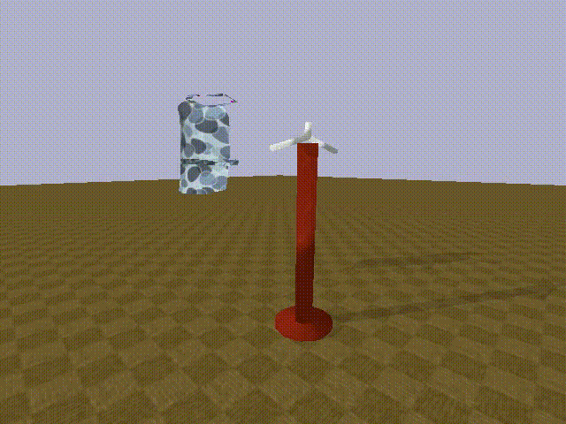
```
python -m dedo.demo_preset --env=HangGarment-v1 --viz
```
`HangGarment-v0`: hang garment with randomized textures 
(a few examples below):


`HangGarment-v[1-5]`: 5 apron meshes and texture combos shown below:


`HangGarment-v[6-10]`: 5 shirt meshes and texture combos shown below:


### HangProcCloth
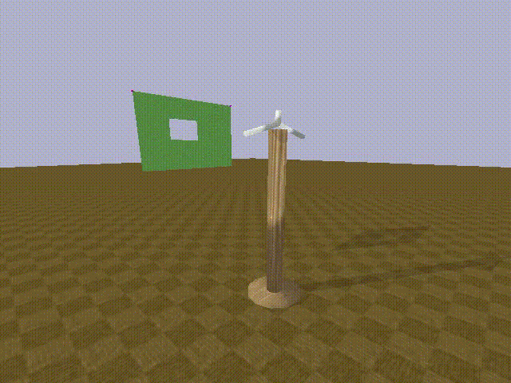
```
python -m dedo.demo_preset --env=HangProcCloth-v1 --viz
```
`HangProcCloth-v0`: random textures, 
procedurally generated cloth with 1 and 2 holes.

`HangProcCloth-v[1-2]`: same, but with either 1 or 2 holes

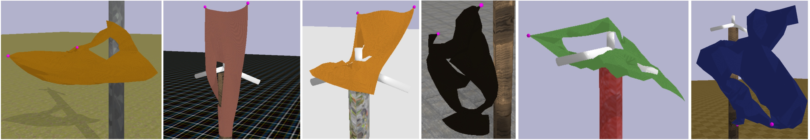

### Buttoning

```
python -m dedo.demo_preset --env=Button-v1 --viz
```
`ButtonProc-v0`: randomized textures and procedurally generated cloth with 
2 holes, randomized hole/button positions.

`ButtonProc-v[1-2]`: procedurally generated cloth, 1 or two holes.


`Button-v0`: randomized textures, but fixed cloth and button positions.

`Button-v1`:  fixed cloth and button positions with one texture 
(see image below):


### Hoop

```
python -m dedo.demo_preset --env=Hoop-v1 --viz
```
`Hoop-v0`: randomized textures
`Hoop-v1`: pre-selected textures
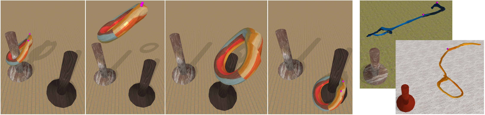
### Lasso
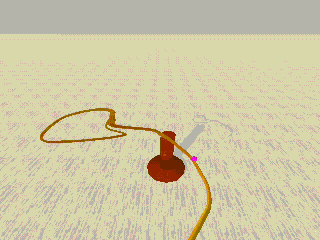
```
python -m dedo.demo_preset --env=Lasso-v1 --viz
```
`Lasso-v0`: randomized textures
`Lasso-v1`: pre-selected textures


### DressBag

```
python -m dedo.demo_preset --env=DressBag-v1 --viz
```
`DressBag-v0`, `DressBag-v[1-5]`: demo for `-v1` shown below


Visualizations of the 5 backpack mesh and texture variants for `DressBag-v[1-5]`:

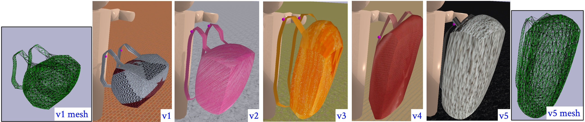
### DressGarment
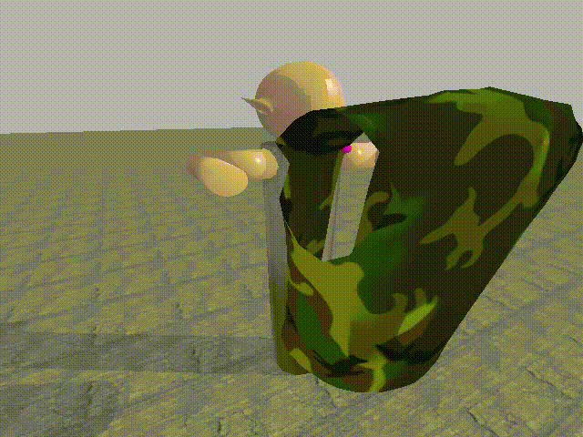
```
python -m dedo.demo_preset --env=DressGarment-v1 --viz
```
`DressGarment-v0`, `DressGarment-v[1-5]`: demo for `-v1` shown below

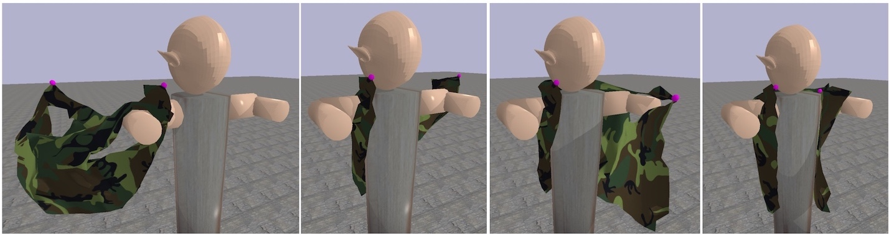

### Mask

```
python -m dedo.demo_preset --env=Mask-v1 --viz
```

`Mask-v0`, `Mask-v[1-5]`: a few texture variants shown below:
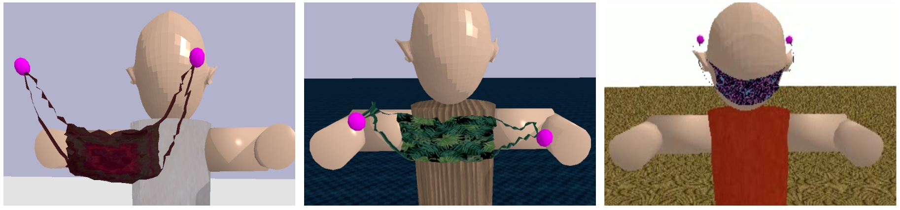
<a name="rl"></a>

### HangGarmentRobot
```
python -m dedo.demo_preset --env=HangGarmentRobot-v1 --viz
```
`HangGarmentRobot-v1`: A environment for demonstrating integration with Franka Robot Arm


### FoodPacking
```
python -m dedo.demo_preset --env=FoodPacking-v1 --viz
```
`FoodPacking-v[0-3]`: Demonstrating robotic manipulation of pushing [YCB objects](https://www.ycbbenchmarks.com/)


## Rendering Point Cloud Observations
DEDO now supports pointcloud observations. Use the flag `--pcd` to set the
environment observations to return point clouds. They are segmented based on the
active rigid and deformable object. 

Example usage, visual demo
```bash
python -m dedo.demo --env=HangGarment-v1 --viz --debug --pcd --logdir rendered
python -m dedo.demo --env=HangBag-v1 --viz --debug --pcd --logdir rendered

```
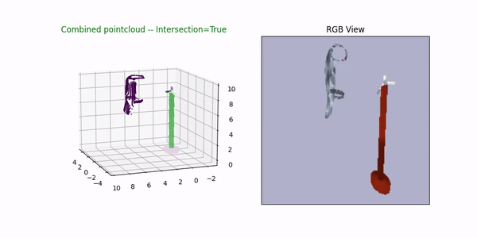

Example usage, preset trajectory demo
```bash
python -m dedo.demo_preset --env=HangGarment-v1 --viz --debug --pcd --logdir rendered
python -m dedo.demo_preset --env=HangBag-v1 --viz --debug --pcd --logdir rendered

```
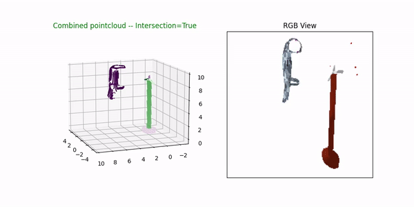


Known issues:
- PyBullet can only segment the deformable object if it has ID=0. We assume this to be true, and load the deformable object first. However, this seems to cause the floor to disappear in the visual render. 


## RL Examples

`dedo/run_rl_sb3.py` gives an example of how to train an RL
algorithm from Stable Baselines 3:

```
python -m dedo.run_rl_sb3 --env=HangGarment-v0 \
    --logdir=/tmp/dedo --num_play_runs=3 --viz --debug
```

`dedo/run_rllib.py` gives an example of how to train an RL
algorithm using RLLib:

```
python -m dedo.run_rllib --env=HangGarment-v0 \
    --logdir=/tmp/dedo --num_play_runs=3 --viz --debug
```

For documentation, please refer to [Arguments Reference](../../wiki/Arguments-Reference) page in wiki

To launch the Tensorboard:
```
tensorboard --logdir=/tmp/dedo --bind_all --port 6006 \
  --samples_per_plugin images=1000
```
<a name="svae"></a>
## SVAE Examples

`dedo/run_svae.py` gives an example of how to train various flavors of VAE:

```
python -m dedo.run_rl_sb3 --env=HangGarment-v0 \
    --logdir=/tmp/dedo --num_play_runs=3 --viz --debug
```

`dedo/run_rllib.py` gives an example of how to train an RL
algorithm from Stable Baselines 3:

```
python -m dedo.run_rl_sb3 --env=HangGarment-v0 \
    --logdir=/tmp/dedo --num_play_runs=3 --viz --debug
```

To launch the Tensorboard:
```
tensorboard --logdir=/tmp/dedo --bind_all --port 6006 \
  --samples_per_plugin images=1000
```


<a name="custom"></a>
## Customization

To load custom object you would first have to fill an entry in `DEFORM_INFO` in 
`task_info.py`. The key should the the `.obj` file path relative to `data/`:

```
DEFORM_INFO = {
...
    # An example of info for a custom item.
    'bags/custom.obj': {
        'deform_init_pos': [0, 0.47, 0.47],
        'deform_init_ori': [np.pi/2, 0, 0],
        'deform_scale': 0.1,
        'deform_elastic_stiffness': 1.0,
        'deform_bending_stiffness': 1.0,
        'deform_true_loop_vertices': [
            [0, 1, 2, 3]  # placeholder, since we don't know the true loops
        ]
    },
```

Then you can use `--override_deform_obj` flag:

```
python -m dedo.demo --env=HangBag-v0 --cam_resolution 200 --viz --debug \
    --override_deform_obj bags/custom.obj
```


For items not in `DEFORM_DICT` you will need to specify sensible defaults,
for example:

```
python -m dedo.demo --env=HangGarment-v0 --viz --debug \
  --override_deform_obj=generated_cloth/generated_cloth.obj \
  --deform_init_pos 0.02 0.41 0.63 --deform_init_ori 0 0 1.5708
```

Example of scaling up the custom mesh objects:
```
python -m dedo.demo --env=HangGarment-v0 --viz --debug \
   --override_deform_obj=generated_cloth/generated_cloth.obj \
   --deform_init_pos 0.02 0.41 0.55 --deform_init_ori 0 0 1.5708 \
   --deform_scale 2.0 --anchor_init_pos -0.10 0.40 0.70 \
   --other_anchor_init_pos 0.10 0.40 0.70
```
See more in **[Customization Wiki](../../wiki/Customization)**

### Additonal Assets
`BGarment` dataset is adapter from [Berkeley Garment Library](http://graphics.berkeley.edu/resources/GarmentLibrary/)

`Sewing` dataset is adapted from [Generating Datasets of 3D Garments with Sewing Patterns](https://openreview.net/forum?id=Pq8FBz0gZHY)
