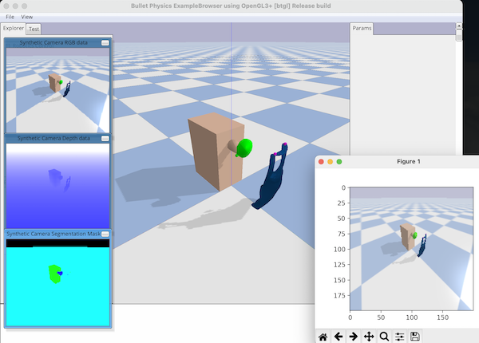
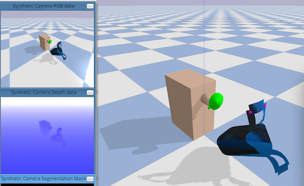

# Dynamic Environments with Deformable Objects

TODO: port the rest of the code and add documentation

Workshop page with paper+poster: https://sites.google.com/nvidia.com/do-sim/posters


**Table of Contents:**<br />
[Installation](#install)<br />
[Examples](#examples)<br />

<a name="install"></a>
## Installation

Optional initial step: create a new conda environment with
`conda create --name dedo python=3.8` and activate it with
`conda activate dedo`. Conda is not strictly needed;
alternatives like virtualenv can be used;
a direct install without using virtual environments is ok as well.

```
git clone https://github.com/contactrika/dedo
cd dedo
pip install numpy
pip install -e .
```


### Examples

```
python -m dedo.demo --task=HangBag --viz --debug
```


```
python -m dedo.demo --task=HangCloth --viz --debug
```


The above will only have anchor positions as the state (this is just for quick
testing). 

To get images as state use `--cam_resolution` flag as follows:

```
python -m dedo.demo --task=HangCloth --cam_resolution 200 --viz --debug
```



To load custom object you would first have to fill an entry in `DEFORM_INFO` in 
`task_info.py`. The key should the the `.obj` file path relative to `data/`:

```
DEFORM_INFO = {
...
    # An example of info for a custom item.
    'bags/bags_zehang/obj/normal/bag1-1.obj': {
        'deform_init_pos': [0, 0.47, 0.47],
        'deform_init_ori': [np.pi/2, 0, 0],
        'deform_scale': 0.1,
        'deform_elastic_stiffness': 1.0,
        'deform_bending_stiffness': 1.0,
        'deform_true_loop_vertices': [
            [0, 1, 2, 3]  # placeholder, since we don't know the true loops
        ]
    },
```

Then you can use `--override_deform_obj` flag:

```
python -m dedo.demo --task=HangBag --cam_resolution 200 --viz --debug \
    --override_deform_obj bags/bags_zehang/obj/normal/bag1-1.obj
```


